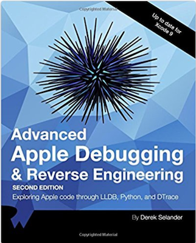

# LLDB

A collection of LLDB aliases/regexes and Python scripts to aid in my debugging sessions. These scripts are built only for my  own amusement, but some of them might be helpful in your own work. If you want to gain a better understanding of how to build these LLDB scripts, or gain a better understanding of LLDB in general, check out [**Advanced Apple Debugging and Reverse Engineering**](https://store.raywenderlich.com/products/advanced-apple-debugging-and-reverse-engineering).

## Installation

1. To Install, copy/clone the **lldb_commands** folder to a dir of your choosing.
2. Open up (or create) **~/.lldbinit** 
3. Add the following command to your ~/.lldbinit file: `command script import /path/to/lldb_commands/dslldb.py`

Boom! You're good to go!

You can test to make sure everything worked successfully by just trying one of the commands in the debugger... i.e. `(lldb) help methods`

I'd recommend cloning. That way when I announce some new script/fix, you can just `git pull` instead of repeating this whole process.

## LLDB Scripts

For all commands below, you can view the documentation via `help {command}`. If you want to see what options a command has, type `{command} -h`.

TLDR: `search`, `lookup`, and `dclass` are good GOTOs irregardless if you're a dev or exploring without source. 

If you like ObjC swizzling, check out `sclass`. If you like DTrace, check out `pmodule` and `snoopie`.

### search

  Searchs the heap for all alive instances of a certain class. This class must by dynamic (aka inherit from a `NSObject`/`SwiftObject` class). Currently doesn't work with `NSString` or `NSNumber` (tagged pointer objects).
  
  Example:
  
      # Find all instances and subclasses of UIView
      (lldb)  search UIView

      # Find all instances of UIView that are UIViews. Ignore subclasses.
      (lldb) search UIView -e

      #Find all instances of UIView whose tag is equal to 5. Objective-C syntax only. Can reference object by 'obj'
      (lldb) search UIView -c "(int)[obj tag]==5"

      # Find all instances of a UIView subclass whose class is implemented in the SpringBoardUI module
      (lldb) search UIView -m SpringBoardUI

      # Find all UIView subclasses created in the "Woot" module and hide them
      (lldb) search UIView -m Woot -p "[obj setHidden:YES]"

      # Search for UIViews but just print the class, don't print object description (ideal for Swift where they hide the pointer)
      (lldb) search UIView -b

      # Remember, Swift includes the module in a class name, so if you have a Swift UIView called TestView in module WOOT...
      (lldb) search WOOT.TestView -b

      # Search for all classes that contain a reference to the pointer 0xfeedfacf
      (lldb) search -r 0xfeedfacf

### dclass

Dumps all the `NSObject`/`SwiftObject` inherited classes in the process. If you give it a module, it will dump only the classes within that module. You can also filter out classes to only a certain type and can also generate a header file for a specific class.
  
  Example:
  
      # Dump ALL the classes (Swift and Objective-C) found within the process
      (lldb) dclass

      # Dump ObjC/Swift info (if applicable) about the class "Hello.SomeClass" (same as dclass -i Hello.SomeClass)
      (lldb) dclass Hello.SomeClass

      # Dump all the classes that are a UIViewController within the process
      (lldb) dclass -f UIViewController

      # Dump all the classes with the regex case insensitive search "viewcontroller" in the class name
      (lldb) dclass -r (?i)viewCoNtrolLer

      # Dump all the classes within the UIKit module
      (lldb) dclass -m UIKit

      # Dump all classes in CKConfettiEffect NSBundle that are UIView subclasses
      (lldb) dclass /System/Library/Messages/iMessageEffects/CKConfettiEffect.bundle/CKConfettiEffect -f UIView

      # Generate a header file for the class specified:
      (lldb) dclass -g UIView

      # Generate a protocol that you can cast an object to. Ideal when working with private classes at dev time
      (lldb) dclass -P UIView

      # Dump all classes and methods for a particular module, ideal for viewing changes in frameworks over time
      (lldb) dclass -o UIKit

      # Only dump classes whose superclass is of type NSObjecr and in the UIKit module. Ideal for going after specific classes like a datasource where it will likely inherit from NSObject
      (lldb) dclass -s NSObject -m UIKit

      # Dump only Swift classes
      (lldb) dclass -t swift

      # Dump only Objective-C classes
      (lldb) dclass -t objc

      # Get a simplified "class-dump" of the UIView class
      (lldb) dclass -i UIView

      # Get more information than you ever wanted to know about UIView
      (lldb) dclass -I UIView

### section

Displays data in the Mach-O segments/sections of the executable or frameworks loaded into the proc

      # Dump the Mach-O segments to the main executable
      (lldb) section

      # Dump the Mach-O segments to UIKit
      (lldb) section UIKit

      # Dump the Mach-O sections of the __TEXT segment of UIKit
      (lldb) section UIKit __TEXT

      # Get the load address of all the hard-coded uint8_t * strings in the UIKit binary
      (lldb) section UIKit __TEXT.__cstring -l

      # Get the entitlements for the executable (simulator only, entitlements for actual app in __LINKEDIT)
      (lldb) section  __TEXT.__entitlements

      # Get all the load address to the lazy symbol stubs in the main executable
      (lldb) section  __DATA.__la_symbol_ptr -l

### dd

Alternative to LLDB's `disassemble` command. Uses colors. Terminal only and designed for x86)64. ARM64 support will come one day...

### sbt

      Symbolicate backtrace. Will symbolicate a stripped backtrace from an executable if the backtrace is using Objective-C
      code. Currently doesn't work on aarch64 stripped executables but works great on x64 :]

      You learn how to make this command in the book :]

### msl

      msl 0xadd7e55
      msl or malloc stack logging will take an address and try and obtain the stack trace to
      when it was created. 

      You will need to set the env var to MallocStackLogging, or `execute turn_on_stack_logging(1)`
      while the process is active

      You learn how to make this command in the book :]

### lookup

Perform a regular expression search for stuff in an executable

  Example:
  
      # Find all methods that contain the phrase viewDidLoad
      (lldb) lookup viewDidLoad

      # Find a summary of all the modules that have a (known) function containing the phrase viewDidLoad
      (lldb) lookup viewDidLoad -s

      # Search for Objective-C code in a stripped module (i.e. in SpringBoard)
      (lldb) loo -x StocksFramework .

      # Search for Objective-C code containing the case insensitive phrase init inside a stripped main bundle
      (lldb) lookup -X (?i)init

      # Search for all hardcoded, embeded `char *` inside an executable containing the phrase *http* inside UIKit
      (lldb) lookup -S http -m UIKit

      # Dump all the md5'd base64 keys in libMobileGestalt along w/ the address in memory
      (lldb) loo -S ^[a-zA-Z0-9\+]{22,22}$ -m libMobileGestalt.dylib -l

      # Dump all the global bss code referenced by DWARF. Ideal for accessing `static` variables when not in scope
      (lldb) lookup . -g HonoluluArt -l

### biof

    Break if on func. Syntax: biof regex1 [OptionalModuleName] ||| regex2 RequiredModuleName
    Regex breakpoint that takes two regex inputs. The first regex creates a breakpoint on all matched functions.
    The second regex will make a breakpoint condition to stop only if the second regex breakpoint is in the stack trace

    For example, to only stop if code in the "TestApp" module resulted in executing the setTintColor: method being called
    biof setTintColor: ||| . Test

    As a tip, it would be wise to have a limited regex1 that matches a small amount of functions, while keeping regex2 at any size

### yoink

  Takes a path on a iOS/tvOS/watchOS and writes to the **/tmp/** dir on your computer.
  If it can be read by `-[NSData dataWithContentsOfFile:]`, it can be written to disk

  Example (on iOS 10 device):

      (lldb) yoink /System/Library/Messages/iMessageEffects/CKConfettiEffect.bundle/CKConfettiEffect

### pmodule

  Creates a custom dtrace script that profiles modules in an executable based upon its
  memory layout and ASLR. Provide no arguments w/ '-a' if you want a count of all the modules firing.
  Provide a module if you want to dump all the methods as they occur. The location of the script is
  copied to your computer so you can paste the soon to be executed dtrace script in the Terminal.
  
  WARNING: YOU MUST DISABLE ROOTLESS TO USE DTRACE
  
      # Trace all Objective-C code in UIKit 
      (lldb) pmodule UIKit

      # Trace all non-Objective-C code in libsystem_kernel.dylib (i.e. pid$target:libsystem_kernel.dylib::entry)
      (lldb) pmodule -n libsystem_kernel.dylib

      # Dump errrything. Only displays count of function calls from modules after you end the script. Warning slow
      (lldb) pmodule -a

### snoopie

    Generates a DTrace sciprt that will only profile classes implemented
    in the main executable irregardless if binary is stripped or not. This is done via
    profiling objc_msgSend. The creation of this command is discussed in the book.

  WARNING: YOU MUST DISABLE ROOTLESS TO USE DTRACE
  
## LLDB Commands

### ls

List a directory from the process's perspective. Useful when working on an actual device.

      # List the root dir's contents on an actual iOS device
      (lldb) ls /

      # List contents for /System/Library on an actual iOS device
      (lldb) ls /System/Library

### reload_lldbinit

Reloads all the contents in your ~/.lldbinit file. Useful for seeing if your python script(s) broke or want to do incremental updates to a python script

    # Reload/Refresh your LLDB scripts
    (lldb) reload_lldbinit

### tv

Toggle view. Hides/Shows a view depending on it's current state. You don't need to resume LLDB to see changes. ObjC only

    # Toggle a view on or off
    (lldb) tv [UIView new]

### pprotocol

Dumps all the required and optional methods for specific protocol (Objective-C only)

    # Dump the protocol for UITableViewDataSource
    (lldb) pprotocol UITableViewDataSource

### pexecutable

Prints the location (on disk) of the filepath to the executable

    (lldb) pexecutable

### pframework

Prints the location (on disk) of a framework

    (lldb) pframework UIKit

### sys

Drops into the shell to execute commands. Note you can execute LLDB commands via the $() syntax

    # ls the directory LLDB is running in
    (lldb) sys ls

    # Use otool -l on the UIKit framework
    (lldb) sys otool -l $(pframework UIKit)

    # Open the main executable in another program
    (lldb) sys open -a "Hopper" $(pexecutable)

### methods

Dumps all methods inplemented by the NSObject subclass (iOS, NSObject subclass only)

    # Get all the methods of UIView
    (lldb) methods UIView

### ivars

Dumps all ivars for an instance of a particular class which inherits from NSObject (iOS, NSObject subclass only)

    # Get all the ivars on a newly created instance of UIView
    (lldb) ivars [UIView new]
    
### dumpenv

Dumps the environment variables found in the process

    (lldb) dumpenv
    
    TESTMANAGERD_SIM_SOCK=/private/tmp/com.apple.launchd.9BmpbuRgyE/com.apple.testmanagerd.unix-domain.socket

    MallocNanoZone=0
    ...

### keychain

Dumps the keychain database relevant to the process

    (lldb) keychain
    <__NSArrayM 0x600001fb1590>(
    {
    acct = "localdevice-AuthToken";
    agrp = apple;
    "v_Data (str)" = "A8CD94D2-13E3-40B...

### info

Determine what the hey the address is. Determines if it's a heap, MachO or stack address

    (lldb) info 0x00007ffee39fd540
    0x00007ffee39fd540, stack address (SP: 0x7ffee39fd4e8, FP: 0x7ffee39fd540) mach_msg_trap 
    
    (lldb) info 0x7ff15e866800
    0x7ff15e866800, 0x7ff15e866800 heap pointer, (0x600 bytes) 
    
    (lldb) info 0x1279232a6
    0x1279232a6,   -[MKPlaceInfoViewController viewDidLoad]     <+0> `MapKit`__TEXT.__text + 0x1813d6 
    
### lsof

List open file descriptors in process. (No args)

    (lldb) lsof 
    0 /dev/null
    1 /dev/null
    2 /dev/null
    4 /Applications/Xcode.app/Contents/Developer/Platforms/iPhoneOS.platform/Developer/Library/CoreSimulator/Profiles/Runtimes/iOS.simruntime/Contents/Resources/RuntimeRoot/System/Library/KeyboardLayouts/USBKeyboardLayouts.bundle/uchrs/US.uchr

### gg 

Suspend the process (good game, AKA game over, weird one, I know). (No args)

### dump_app_contents

Dumps contents of application bundle. (No args)

### mload 

dlopen convenience method

### pbpaste 

Paste selected text from your mac to your iOS device. (No args, but make sure you have something in the clipboard)

### bdel 

Delete breakpoint by address 

### data

Dump the bytes of a NSData object

### pexecutable

Dumps the fullpath to the executable. (No args)

### plocalmodulelist

Dumps the local modules specific for the application. (No args)

### overlaydbg

Displays the UIDebuggingInformationOverlay on iOS in 11. Check out http://ryanipete.com/blog/ios/swift/objective-c/uidebugginginformationoverlay/ for instructions

    # Display UIDebuggingInformationOverlay
    (lldb) overlaydbg

You read all the way to here!? [Here's a video highlighting some of these scripts](https://vimeo.com/231806976)
